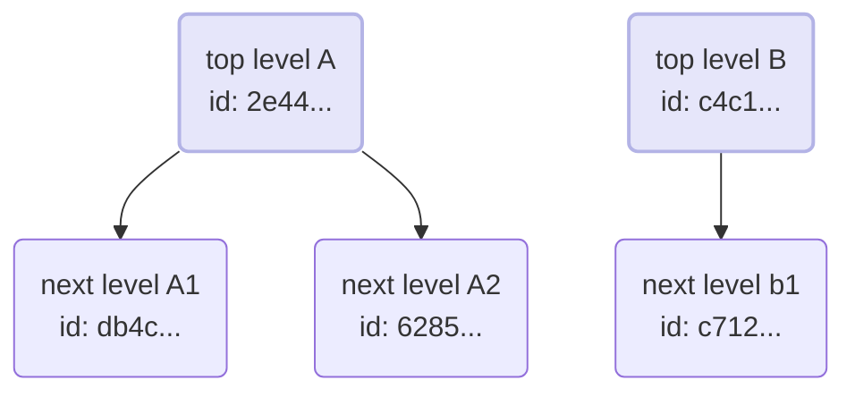

# Building Structured Notebooks for `mrx link` with `jupytext`

This guide outlines a workflow for creating and managing notebooks with a dependency-based, flowchart-like structure for visualization in tools like `mrx link`. By leveraging `jupytext`, we can define this structure within a version-control-friendly Python script.

The entire system relies on embedding custom metadata within the `jupytext` cell markers.

---

## 1. The Core Concept: `canvas` Metadata

Each cell in a `jupytext`-powered Python script is marked by `# %%`. The hierarchical structure is defined by a JSON object assigned to a `canvas` key within this marker. By editing this `canvas` object, you can programmatically define the relationships between cells.

---

## 2. Metadata Schema Breakdown

While there are several keys, two are critical for building the graph structure: `id` and `parents`.

*   `id` (`string`): **A mandatory, unique identifier for the cell.** This is the "address" that other cells use to reference it as a parent. Best practice is to use a UUID.
*   `parents` (`array`): **An array of parent objects.** This defines the incoming connections to the cell, creating the graph.
    *   For a **top-level (root) cell**, this array must be empty (`[]`).
    *   For a **child cell**, this array contains one or more objects, each pointing to a parent cell's `id` and `name`.
*   `name` (`string`): The human-readable label that will appear on the cell in the visual graph.
*   `componentType` (`string`): Defines the type of the cell (e.g., `"CodeCell"`).
*   Other keys like `diskcache`, `headerColor`, `isComponent`, and `copiedOriginId` control the appearance and behavior of the cell in the `mrx link` tool.

### Full Raw Metadata Example

Here is a complete, raw example of the `canvas` metadata for a single cell. In your `.py` script, this entire JSON object would be on a single line following the `# %% canvas=` marker.

```json
{
    "componentType": "CodeCell",
    "copiedOriginId": null,
    "diskcache": false,
    "headerColor": "transparent",
    "id": "a1b2c3d4-e5f6-7890-1234-567890abcdef",
    "isComponent": true,
    "name": "Child Cell: Process Data",
    "parents": [
        {
            "id": "parent-cell-id-goes-here",
            "name": "Parent Cell: Load Data"
        }
    ]
}
```

---

## 3. How to Build the Graph: Examples

### Defining a Root (Parent) Cell

To create a cell with no dependencies, give it a unique `id` and an empty `parents` array.

```python
# %% canvas={"id": "abc-123", "name": "Data Loading", "parents": []}
# Your code for loading data here
```

### Defining a Child Cell

To create a cell that depends on the "Data Loading" cell, add a reference to it in the `parents` array.

```python
# %% canvas={"id": "def-456", "name": "Data Cleaning", "parents": [{"id": "abc-123", "name": "Data Loading"}]}
# This cell's execution depends on the "Data Loading" cell.
# Your data cleaning code here.
```

By following this pattern, you can define complex, multi-level dependencies.

---

## 4. The `jupytext` Round-Trip Workflow

This structure is fully compatible with the `jupytext` conversion process, allowing you to switch between the `.py` script and a visual `.ipynb` notebook.

*   **To generate the notebook from your script:**
    ```bash
    jupytext --to notebook my_structured_script.py
    ```

*   **To update the script from notebook edits:**
    ```bash
    jupytext --to py:percent my_structured_script.ipynb
    ```

This round-trip capability ensures that your complex graph structure is preserved and can be effectively version-controlled.

---

## 5. Detailed Mapping: From Metadata to Visual Graph

To make the relationship between metadata and the final visual structure perfectly clear, let's analyze the `test_mrx.py` example file cell by cell.

### The Visual Graph

This Mermaid diagram is the visual representation created directly from the `parents` metadata in each cell.



### Cell-by-Cell Breakdown

#### Root Cell: `top level A`
*   **Content:**
    ```python
    """
    top level A cell data 
    """
    ```
*   **Metadata (`parents`: [])**
    This cell has an empty `parents` array, making it a root node in the graph.
    ```json
    {
        "id": "2e442dc7-8dfd-489b-a454-90d2fd4e6747",
        "name": "top level A",
        "parents": []
    }
    ```

#### Root Cell: `top level B`
*   **Content:**
    ```python
    """
    top level B cell data 
    """
    ```
*   **Metadata (`parents`: [])**
    Like the cell above, this is a root node because its `parents` array is empty.
    ```json
    {
        "id": "c4c1dbba-62a2-4ad7-b01e-0f3885e25b1b",
        "name": "top level B ",
        "parents": []
    }
    ```

#### Child Cell: `next level A1`
*   **Content:**
    ```python
    """next level A1"""
    ```
*   **Metadata (`parents`: [ref_to_A])**
    This cell's `parents` array contains a reference to `top level A` via its `id`. This creates the arrow from `A` to `A1` in the chart.
    ```json
    {
        "id": "db4c2879-b13e-42a7-9b05-3fb70f56d8d6",
        "name": "next level A1",
        "parents": [
            {
                "id": "2e442dc7-8dfd-489b-a454-90d2fd4e6747",
                "name": "top level A"
            }
        ]
    }
    ```

#### Child Cell: `next level A2`
*   **Content:**
    ```python
    """next level A2"""
    ```
*   **Metadata (`parents`: [ref_to_A])**
    This cell also references `top level A` as its parent, creating the second branch from `A`.
    ```json
    {
        "id": "6285afb5-a509-4489-843c-bcc201968b4e",
        "name": "next level A2",
        "parents": [
            {
                "id": "2e442dc7-8dfd-489b-a454-90d2fd4e6747",
                "name": "top level A"
            }
        ]
    }
    ```

#### Child Cell: `next level b1`
*   **Content:**
    ```python
    """next level b1"""
    ```
*   **Metadata (`parents`: [ref_to_B])**
    Finally, this cell's `parents` array points to the `id` of `top level B`, creating the second, independent graph.
    ```json
    {
        "id": "c71212e4-18b3-4c14-b8b0-60fef20212e6",
        "name": "next level b1",
        "parents": [
            {
                "id": "c4c1dbba-62a2-4ad7-b01e-0f3885e25b1b",
                "name": "top level B "
            }
        ]
    }
    ```
